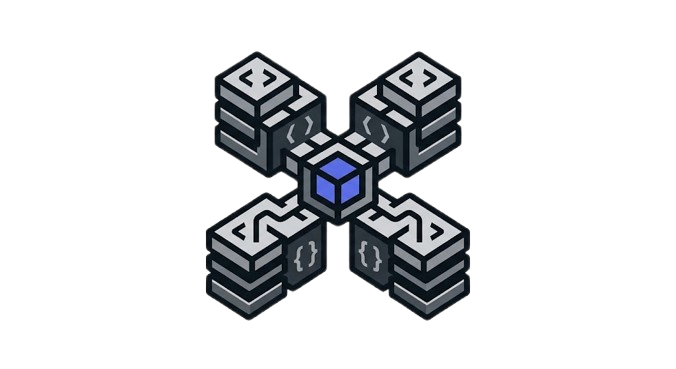

<div align="center">
  
  <h1>Discord Handler</h1>
  <p><strong>A multi-language Discord bot framework — choose your language, build your bot.</strong></p>

  <p>
    <a href="https://github.com/RealMtrx/Discord-Handler/blob/main/LICENSE"></a>
    <a href="https://github.com/RealMtrx/Discord-Handler/releases"></a>
    <a href="https://github.com/RealMtrx/Discord-Handler/stargazers"></a>
    <a href="https://github.com/RealMtrx/Discord-Handler/issues"></a>
    <a href="https://github.com/RealMtrx/Discord-Handler/pulls"></a>
    <a href="https://github.com/RealMtrx/Discord-Handler/network"></a>
    <a href="https://github.com/RealMtrx/Discord-Handler/graphs/contributors"></a>
  </p>

  <br>

  <p>
    <a href="#-languages">Languages</a> •
    <a href="#-features">Features</a> •
    <a href="#-quick-start">Quick Start</a> •
    <a href="#-documentation">Documentation</a> •
    <a href="#-faq">FAQ</a> •
    <a href="#-roadmap">Roadmap</a> •
    <a href="#-contributing">Contributing</a>
  </p>
</div>

---

## Introduction

Discord Handler is an open-source, multi-language Discord bot framework designed for scalability and maintainability.  
Whether you are a beginner writing your first bot in Python or a seasoned engineer deploying in Rust, Discord Handler provides a consistent, modular architecture across **13 programming languages**.

Each implementation follows the same design principles — slash commands, prefix commands, MongoDB integration, anti-crash protection, webhook logging, and a clean `src/` structure — so you can switch languages without relearning architecture.

---

## Why Discord Handler?

| Challenge                    | Discord Handler Solution                                    |
| ---------------------------- | ----------------------------------------------------------- |
| Too many boilerplate setups  | Pre-built modular structure for every popular language      |
| Switching languages          | Same architecture, same patterns, different syntax          |
| Missing error handling       | Built-in anti-crash and webhook error reporting             |
| No MongoDB integration       | Ready-to-use database layer in every implementation         |
| Inconsistent project layout  | Standardized `src/` directory with clear separation of concerns |

---

## Features

- **Dual Command System** — Slash commands and prefix commands in every language
- **Modular Architecture** — Commands, events, handlers, and models are cleanly separated
- **Anti-Crash Protection** — Comprehensive error handling that keeps your bot online
- **MongoDB Integration** — Persistent data storage pre-configured in every implementation
- **Webhook Logging** — Real-time error and guild event reporting to Discord channels
- **Cooldown System** — Per-command rate limiting to prevent spam
- **Unicode Emoji System** — Flat-export emoji constants for consistent cross-platform rendering
- **Environment Configuration** — Secure token and secret management via `.env` files
- **Event-Driven Architecture** — Fully reactive design in every language
- **Startup Reporting** — Color-coded terminal banner showing loaded commands, events, and connection status

---

## Architecture

Every Discord Handler implementation follows the same layered architecture:

```
src/
├── main.*                  # Entry point — initializes config, database, and client
├── config/                 # Environment variable loading and configuration object
├── Core/                   # Shared utilities (emojis, cooldowns, webhooks)
├── Database/               # MongoDB connection and helpers
├── Events/                 # Discord event listeners (ready, guild, interaction, message)
├── Handlers/               # Anti-crash and logging subsystems
├── Models/                 # Data models for persistent storage
└── Commands/
    ├── Slash/              # Application (slash) commands
    └── Prefix/             # Traditional prefix commands
```

### Data Flow

```
Discord Gateway → Event Handler → Dispatcher
                                      ├── Slash Commands → Interaction Handler → Response
                                      └── Prefix Commands → Message Handler → Response
                                              │
                                              └── Cooldown Check → Execute → Reply
```

---

## Languages

| Language   | Repository                                       | Library          | Status |
| ---------- | ------------------------------------------------ | ---------------- | ------ |
| JavaScript | https://github.com/RealMtrx/Discord-Handler-Js   | Discord.js v14   | ✅     |
| TypeScript | https://github.com/RealMtrx/Discord-Handler-Ts   | Discord.js v14   | ✅     |
| Go         | https://github.com/RealMtrx/Discord-Handler-Go   | DiscordGo        | ✅     |
| Rust       | https://github.com/RealMtrx/Discord-Handler-Rs   | Serenity         | ✅     |
| Python     | https://github.com/RealMtrx/Discord-Handler-Py   | discord.py v2    | ✅     |
| C#         | https://github.com/RealMtrx/Discord-Handler-Cs   | Discord.Net v3   | ✅     |
| Java       | https://github.com/RealMtrx/Discord-Handler-Java | JDA v5           | ✅     |
| Kotlin     | https://github.com/RealMtrx/Discord-Handler-Kt   | Kord             | ✅     |
| C++        | https://github.com/RealMtrx/Discord-Handler-Cpp  | DPP              | ✅     |
| Dart       | https://github.com/RealMtrx/Discord-Handler-Dart | Nyxx             | ✅     |
| Ruby       | https://github.com/RealMtrx/Discord-Handler-Rb   | Discordrb        | ✅     |
| Lua        | https://github.com/RealMtrx/Discord-Handler-Lua  | Discordia        | ✅     |
| PHP        | https://github.com/RealMtrx/Discord-Handler-Php  | DiscordPHP       | ✅     |

---

## Quick Start

```bash
# Clone any implementation
git clone https://github.com/RealMtrx/Discord-Handler-Js.git
cd Discord-Handler-Js

# Install dependencies
npm install

# Configure your bot
cp .env.example .env
# Edit .env with your token and settings

# Run
npm start
```

Each language has its own repository with dedicated instructions. Pick yours from the table above.

---

## Repository Structure

```
Discord-Handler/
├── .github/                   # Issue templates, PR template, workflows
│   ├── ISSUE_TEMPLATE/
│   └── workflows/
├── assets/                    # Logos and media
├── docs/                      # Detailed documentation
│   ├── installation.md
│   ├── creating-a-bot.md
│   ├── commands.md
│   ├── events.md
│   ├── components.md
│   ├── buttons.md
│   ├── select-menus.md
│   ├── modals.md
│   ├── permissions.md
│   ├── error-handling.md
│   ├── sharding.md
│   └── best-practices.md
├── examples/                  # Basic bot example in every language
│   ├── javascript/
│   ├── typescript/
│   ├── go/
│   ├── rust/
│   ├── python/
│   ├── csharp/
│   ├── java/
│   ├── kotlin/
│   ├── cpp/
│   ├── dart/
│   ├── ruby/
│   ├── lua/
│   └── php/
├── LICENSE
├── README.md
├── CONTRIBUTING.md
├── CODE_OF_CONDUCT.md
├── SECURITY.md
├── CHANGELOG.md
└── ROADMAP.md
```

---

## Comparison Table

| Feature                | JS  | TS  | Go  | Rust | Python | C#  | Java | Kotlin | C++ | Dart | Ruby | Lua | PHP |
| ---------------------- | --- | --- | --- | ---- | ------ | --- | ---- | ------ | --- | ---- | ---- | --- | --- |
| Slash Commands         | ✅  | ✅  | ✅  | ✅   | ✅     | ✅  | ✅   | ✅     | ✅  | ✅   | ✅   | ✅  | ✅  |
| Prefix Commands        | ✅  | ✅  | ✅  | ✅   | ✅     | ✅  | ✅   | ✅     | ✅  | ✅   | ✅   | ✅  | ✅  |
| MongoDB                | ✅  | ✅  | ✅  | ✅   | ✅     | ✅  | ✅   | ✅     | ⚠️  | ✅   | ✅   | ⚠️  | ✅  |
| Anti-Crash             | ✅  | ✅  | ✅  | ✅   | ✅     | ✅  | ✅   | ✅     | ✅  | ✅   | ✅   | ✅  | ✅  |
| Webhook Logging        | ✅  | ✅  | ✅  | ✅   | ✅     | ✅  | ✅   | ✅     | ✅  | ✅   | ✅   | ✅  | ✅  |
| Cooldowns              | ✅  | ✅  | ✅  | ✅   | ✅     | ✅  | ✅   | ✅     | ✅  | ✅   | ✅   | ✅  | ✅  |
| Unicode Emojis         | ✅  | ✅  | ✅  | ✅   | ✅     | ✅  | ✅   | ✅     | ✅  | ✅   | ✅   | ✅  | ✅  |
| Dynamic Command Loading| ✅  | ✅  | ✅  | ✅   | ✅     | ✅  | ✅   | ✅     | ✅  | ✅   | ✅   | ✅  | ✅  |
| Async/Await            | ✅  | ✅  | ✅  | ✅   | ✅     | ✅  | ✅   | ✅     | ✅  | ✅   | ✅   | ⚠️  | ✅  |

> ⚠️ C++ and Lua MongoDB support are stubs (require mongocxx / luamongo respectively).  
> Lua uses callbacks rather than native async/await.

---

## Examples

### JavaScript

```javascript
const { Client, GatewayIntentBits } = require('discord.js');
const client = new Client({ intents: [GatewayIntentBits.Guilds, GatewayIntentBits.GuildMessages, GatewayIntentBits.MessageContent] });

client.on('ready', () => console.log(`Logged in as ${client.user.tag}`));

client.on('interactionCreate', async interaction => {
  if (!interaction.isChatInputCommand()) return;
  if (interaction.commandName === 'ping') {
    await interaction.reply('Pong!');
  }
});

client.login(process.env.TOKEN);
```

### TypeScript

```typescript
import { Client, GatewayIntentBits } from 'discord.js';
const client = new Client({ intents: [GatewayIntentBits.Guilds, GatewayIntentBits.GuildMessages, GatewayIntentBits.MessageContent] });

client.on('ready', () => console.log(`Logged in as ${client.user!.tag}`));

client.on('interactionCreate', async interaction => {
  if (!interaction.isChatInputCommand()) return;
  if (interaction.commandName === 'ping') {
    await interaction.reply('Pong!');
  }
});

client.login(process.env.TOKEN);
```

### Go

```go
package main

import (
  "fmt"
  "github.com/bwmarrin/discordgo"
)

func main() {
  dg, _ := discordgo.New("Bot " + token)
  dg.AddHandler(func(s *discordgo.Session, i *discordgo.InteractionCreate) {
    if i.ApplicationCommandData().Name == "ping" {
      s.InteractionRespond(i.Interaction, &discordgo.InteractionResponse{
        Type: discordgo.InteractionResponseChannelMessageWithSource,
        Data: &discordgo.InteractionResponseData{Content: "Pong!"},
      })
    }
  })
  dg.Identify.Intents = discordgo.IntentsAllWithoutPrivileged
  dg.Open()
  select {}
}
```

### Rust

```rust
use serenity::prelude::*;
use serenity::all::*;

struct Handler;

#[serenity::async_trait]
impl EventHandler for Handler {
  async fn interaction_create(&self, ctx: Context, interaction: Interaction) {
    if let Some(command) = interaction.as_command() {
      if command.data.name == "ping" {
        command.create_response(&ctx.http, CreateInteractionResponse::Message(
          CreateInteractionResponseMessage::new().content("Pong!"),
        )).await.unwrap();
      }
    }
  }
}

#[tokio::main]
async fn main() {
  let token = std::env::var("TOKEN").unwrap();
  let mut client = Client::builder(&token, GatewayIntents::all()).event_handler(Handler).await.unwrap();
  client.start().await.unwrap();
}
```

### Python

```python
import discord
from discord import app_commands

class Bot(discord.Client):
  async def on_ready(self):
    print(f'Logged in as {self.user}')
    await tree.sync()

  async def on_message(self, message):
    if message.author.bot: return
    if message.content.startswith('!ping'):
      await message.reply('Pong!')

intents = discord.Intents.default()
intents.message_content = True
bot = Bot(intents=intents)
tree = app_commands.CommandTree(bot)

@tree.command(name='ping', description='Replies with Pong!')
async def ping(interaction: discord.Interaction):
  await interaction.response.send_message('Pong!')

bot.run(TOKEN)
```

### C#

```csharp
using Discord;
using Discord.WebSocket;

var config = new DiscordSocketConfig { GatewayIntents = GatewayIntents.AllUnprivileged };
var client = new DiscordSocketClient(config);

client.Ready += () => { Console.WriteLine("Ready!"); return Task.CompletedTask; };
client.SlashCommandExecuted += async command => {
  if (command.Data.Name == "ping") await command.RespondAsync("Pong!");
};
client.MessageReceived += async msg => {
  if (msg.Author.IsBot) return;
  if (msg.Content.StartsWith("!ping")) await msg.Channel.SendMessageAsync("Pong!");
};

await client.LoginAsync(TokenType.Bot, token);
await client.StartAsync();
await Task.Delay(-1);
```

### Java

```java
import net.dv8tion.jda.api.*;
import net.dv8tion.jda.api.events.interaction.command.SlashCommandInteractionEvent;
import net.dv8tion.jda.api.hooks.ListenerAdapter;

public class Main extends ListenerAdapter {
  public static void main(String[] args) throws Exception {
    JDABuilder.createLight(token)
      .addEventBus(new Main())
      .build();
  }

  @Override
  public void onSlashCommandInteraction(SlashCommandInteractionEvent event) {
    if (event.getName().equals("ping")) event.reply("Pong!").queue();
  }
}
```

### Kotlin

```kotlin
import dev.kord.core.Kord
import dev.kord.core.event.InteractionCreateEvent
import dev.kord.core.on

suspend fun main() {
  val kord = Kord(token)
  kord.on<InteractionCreateEvent> {
    if (interaction.commandName == "ping") {
      interaction.respond { content = "Pong!" }
    }
  }
  kord.login()
}
```

### C++

```cpp
#include <dpp/dpp.h>

int main() {
  dpp::cluster bot(token);
  bot.on_slashcommand([](const dpp::slashcommand_t& event) {
    if (event.command.get_command_name() == "ping") event.reply("Pong!");
  });
  bot.on_ready([&bot](const dpp::ready_t&) {
    bot.global_command_create(dpp::slashcommand("ping", "Replies with Pong!", bot.me.id));
  });
  bot.start(dpp::st_wait);
  return 0;
}
```

### Dart

```dart
import 'package:nyxx/nyxx.dart';

void main() async {
  final client = await Nyxx.connectGateway(token, GatewayIntents.allUnprivileged);
  client.onReady.listen((_) => print('Ready!'));
  client.onInteractionCreate.listen((event) async {
    final interaction = event.interaction;
    if (interaction is ISlashCommandInteraction && interaction.commandName == 'ping') {
      await interaction.respond(MessageBuilder(content: 'Pong!'));
    }
  });
}
```

### Ruby

```ruby
require 'discordrb'

bot = Discordrb::Bot.new(token: token, intents: :all)

bot.message(content: '!ping') do |event|
  event.respond('Pong!')
end

bot.application_command(:ping) do |event|
  event.respond(content: 'Pong!')
end

bot.run
```

### Lua

```lua
local discordia = require('discordia')
local client = discordia.Client()

client:on('ready', function()
  print('Ready!')
end)

client:on('messageCreate', function(msg)
  if msg.content == '!ping' then msg:reply('Pong!') end
end)

client:on('interactionCreate', function(interaction)
  if interaction.type == 2 and interaction.data.name == 'ping' then
    interaction:reply({ content = 'Pong!' })
  end
end)

client:run('Bot ' .. token)
```

### PHP

```php
<?php

require 'vendor/autoload.php';

use Discord\Discord;
use Discord\WebSockets\Event;
use Discord\Builders\MessageBuilder;

$discord = new Discord(['token' => $token]);

$discord->on(Event::READY, function () { echo "Ready!\n"; });

$discord->on(Event::INTERACTION_CREATE, function ($interaction) {
  if ($interaction->data->name === 'ping') {
    $interaction->respond(MessageBuilder::new()->setContent('Pong!'));
  }
});

$discord->run();
```

---

## Documentation

| Topic                    | Description                                          |
| ------------------------ | ---------------------------------------------------- |
| [Installation](docs/installation.md)    | Setting up a Discord bot from scratch          |
| [Creating a Bot](docs/creating-a-bot.md) | Registering your application and inviting it  |
| [Commands](docs/commands.md)           | Slash commands, prefix commands, and subcommands |
| [Events](docs/events.md)              | Listening and responding to Discord events        |
| [Components](docs/components.md)        | Buttons, select menus, and other UI components    |
| [Buttons](docs/buttons.md)            | Creating and handling button interactions          |
| [Select Menus](docs/select-menus.md)     | Dropdown menus for user input                   |
| [Modals](docs/modals.md)             | Pop-up forms for structured input                  |
| [Permissions](docs/permissions.md)      | Managing user and bot permissions                  |
| [Error Handling](docs/error-handling.md)  | Graceful failure and recovery strategies       |
| [Sharding](docs/sharding.md)          | Scaling your bot across multiple processes         |
| [Best Practices](docs/best-practices.md)  | Production-ready patterns and conventions      |

---

## FAQ

**Which language should I choose?**

Pick the language you are most comfortable with. All implementations share the same architecture. If you need maximum performance, try Rust or Go. For rapid prototyping, Python or JavaScript.

**Can I mix languages in one bot?**

No. Each implementation is standalone. However, you can run multiple bots (each in a different language) under a single application.

**Do I need MongoDB?**

No. The MongoDB layer is optional. Remove the MongoDB call in the main entry point and the bot will run without it.

**How do I report a bug?**

Open an issue in the specific language repository (e.g., `Discord-Handler-Js/issues`). For cross-cutting concerns, open in the main `Discord-Handler` repo.

**Is there a hosted version?**

Not yet. This is a framework, not a service. You deploy the bot yourself.

**How do I add a new language?**

Fork the repository, create a new directory under your name, and submit a pull request. See CONTRIBUTING.md for guidelines.

---

## Roadmap

- [x] JavaScript implementation
- [x] TypeScript implementation
- [x] Go implementation
- [x] Rust implementation
- [x] Python implementation
- [x] C# implementation
- [x] Java implementation
- [x] Kotlin implementation
- [x] C++ implementation
- [x] Dart implementation
- [x] Ruby implementation
- [x] Lua implementation
- [x] PHP implementation
- [ ] Zig implementation
- [ ] Nim implementation
- [ ] Swift implementation
- [ ] Community-driven language templates
- [ ] Interactive CLI starter wizard

Full details: [ROADMAP.md](ROADMAP.md)

---

## Contributing

Contributions are what make the open-source community such an amazing place. Any contribution you make is **greatly appreciated**.

See [CONTRIBUTING.md](CONTRIBUTING.md) for our code of conduct and the process for submitting pull requests.

### Quick Start for Contributors

1. Fork the repository for your target language
2. Create a feature branch (`git checkout -b feature/amazing-feature`)
3. Commit your changes (`git commit -m 'Add amazing feature'`)
4. Push to the branch (`git push origin feature/amazing-feature`)
5. Open a Pull Request

---

## License

Distributed under the MIT License. See [LICENSE](LICENSE) for more information.

Copyright © 2026 Mtrx — Discord: 0hu2

---

## Credits

- **Discord.js** — https://discord.js.org
- **Serenity** — https://github.com/serenity-rs/serenity
- **DiscordGo** — https://github.com/bwmarrin/discordgo
- **discord.py** — https://github.com/Rapptz/discord.py
- **Discord.Net** — https://github.com/discord-net/Discord.Net
- **JDA** — https://github.com/DV8FromTheWorld/JDA
- **Kord** — https://github.com/kordlib/kord
- **DPP** — https://dpp.dev
- **Nyxx** — https://github.com/nyxx-discord/nyxx
- **Discordrb** — https://github.com/shardlab/discordrb
- **Discordia** — https://github.com/SinisterRectus/Discordia
- **DiscordPHP** — https://github.com/discord-php/DiscordPHP

---

<div align="center">
  <sub>Built by <strong>Mtrx</strong> — Discord: <strong>0hu2</strong></sub>
</div>
